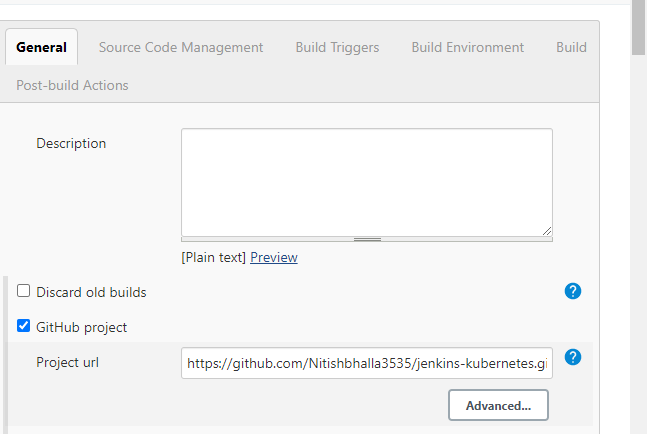
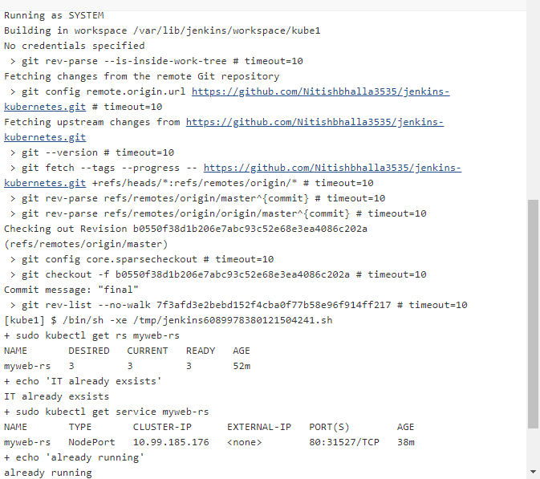

# jenkins-kubernetes
This is a mini project  showing power of integration of jenkins and kubernetes.
project is as follows:
RS yml code is pushed to github which is used to create the pod by the developer

.PNG)

Job k1  is created on jenkins 

I have triggered the job using Poll scm but GitHub hook trigger(better than poll scm) can also be used 

.PNG)

Now the shell code executed is :

.PNG)

I have uploaded the shell code used in shell code folder.

Here is the output:

Thank you for reading this repo.

